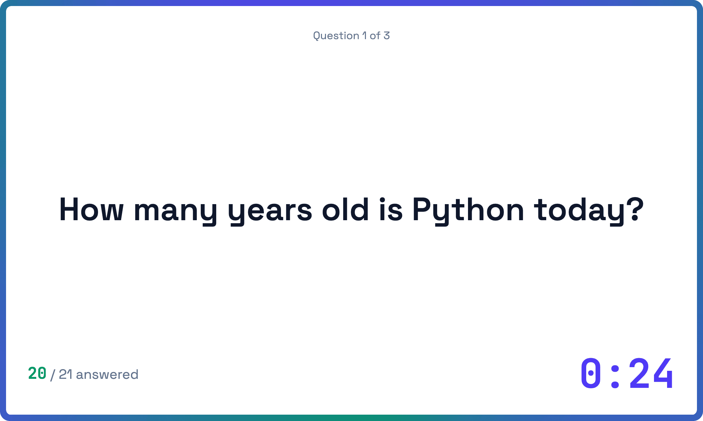
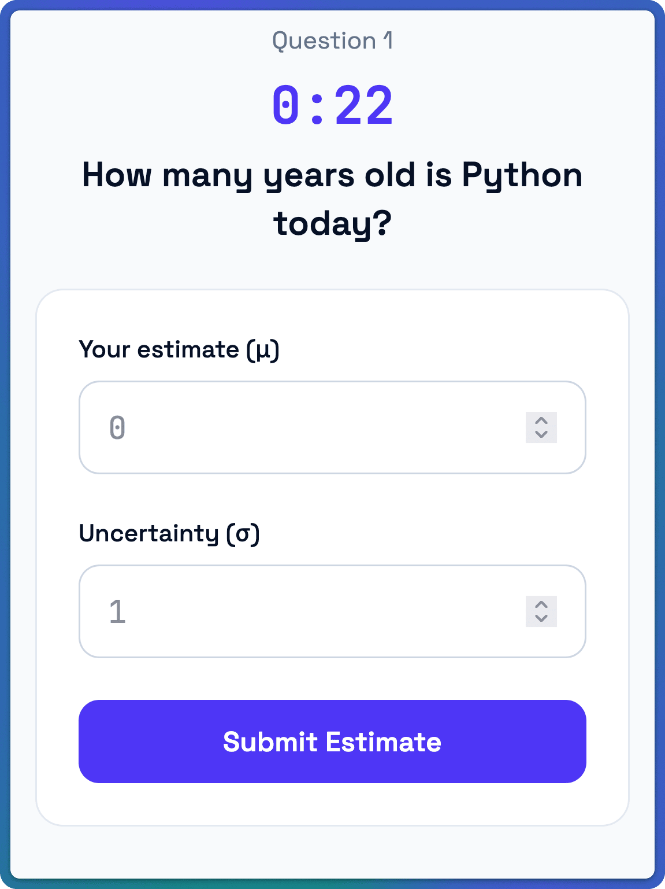
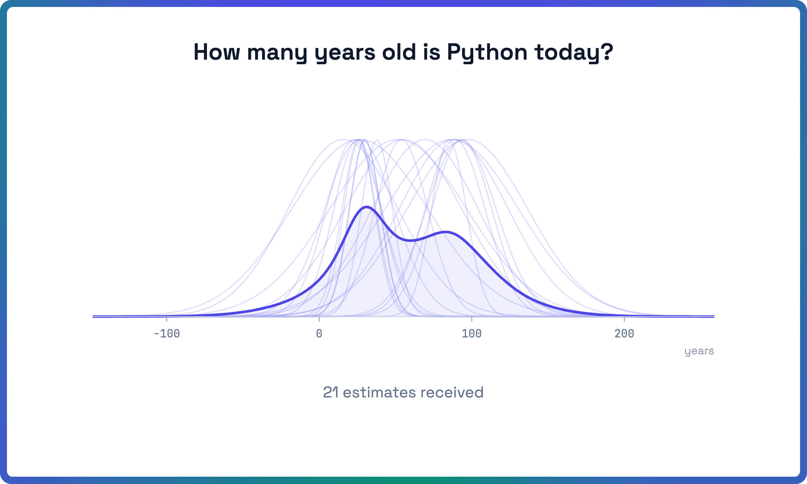
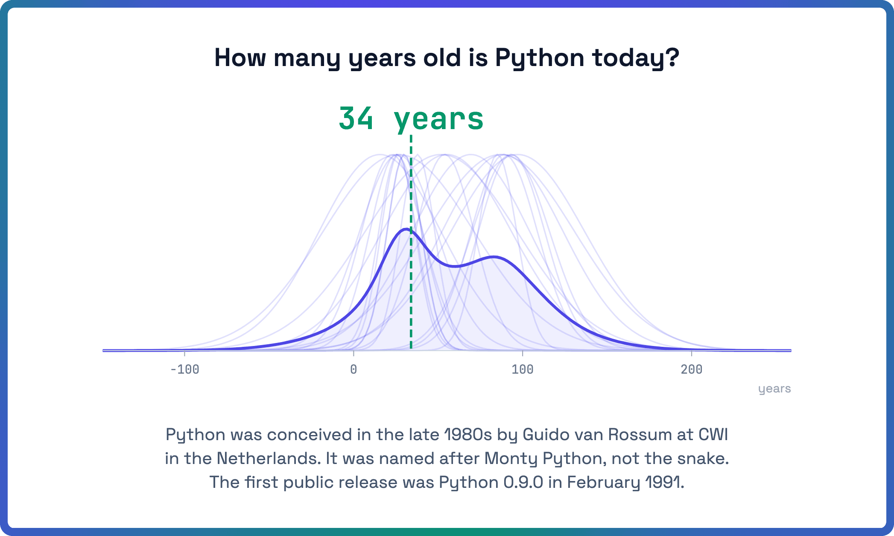

[](https://opensource.org/licenses/MIT)
[](https://www.python.org/downloads/)
[](https://x.com/i/trending/2006300642797625572)
<a href="https://railway.com/deploy/bayesian-quiz?referralCode=TDYt-6"></a>

# Bayesian Quiz

A real-time pub quiz for data scientists where players estimate numerical answers with uncertainty. Instead of just guessing a number, players submit a mean (μ) and standard deviation (σ). Scoring rewards **calibrated confidence** using the Continuous Ranked Probability Score (CRPS) — being right matters, but so does knowing how sure you are.

---

It's like a normal pub quiz:



But players give both their guess and a standard deviation:



Once the time is up, see what the crowd thinks...



and what the correct answer is:



---

## Prerequisites

- Python 3.14+
- [uv](https://docs.astral.sh/uv/)

## Quick start

```sh
git clone <this repo>
cd bayesian-quiz

export QUIZMASTER_PASS=trustno1
uv run bayesian-quiz
```

Open these in a browser:

| URL | Who |
|-----|-----|
| <http://localhost:8000/control> | Quizmaster |
| <http://localhost:8000/projector?sample> | Projector |
| <http://localhost:8000/play?sample> | Players |

The sample quiz (`quizzes/sample.txt`) is included.

## Write your own quiz

Create a file in the `quizzes/` directory, e.g. `quizzes/myquiz.txt`.
The quiz code will be `myquiz`. For a sample, see `quizzes/sample.txt`.

Questions are defined in a vaguely rfc822-like format, separated by blank lines. Fields:

| Field | Required | Description |
|-------|----------|-------------|
| `Intro` | no | Text shown on the screen before the question itself |
| `Question` | yes | The question text shown to players |
| `Answer` | yes | The correct numerical answer |
| `Unit` | yes | Unit label shown on the answer (e.g. `years`, `GeV`) |
| `Scale` | yes | CRPS normalization factor — see below |
| `Factoid` | no | Fun fact revealed after the answer |

### Mini-markup in question text

Question, Factoid, and Intro fields support a small subset of markup:

| Syntax | Result |
|--------|--------|
| `*text*` | Italic |
| `` `text` `` | Inline code |
| `<br>` | Line break |
| `\*` | Literal asterisk |

### Choosing Scale

`Scale` controls how harshly scores are penalized for being far off. A rule of thumb: set `Scale` to roughly the standard deviation you'd expect from a well-calibrated expert. If you expect typical answers to be within ±10 years, use `Scale: 10.0`. Smaller scale = steeper penalty for missing.

### Good questions

- Have a definitive numerical answer you can verify

## Running a quiz session

You need three browser windows or devices:

| URL | Who | What |
|-----|-----|-------|
| `http://host/control` | Quizmaster | Control panel — advance phases, see answers |
| `http://host/projector?{slug}` | Projector screen | Answer distributions, correct answers, leaderboards |
| `http://host/play?{slug}` | Each player | On their phone or laptop |

Replace `{slug}` with your quiz filename without `.txt` (e.g. `?myquiz`).

The quizmaster interface is protected by HTTP basic auth (`QUIZMASTER_USER` / `QUIZMASTER_PASS`).

### Flow

1. Open `/projector?{slug}` on the big screen — shows a QR code pointing to `/play?{slug}`
2. Players scan the QR code, pick a nickname, and wait in the lobby
3. Quizmaster opens `/control`, selects the quiz, and clicks **Start Quiz**
4. For each question:
   - Players have 30 seconds to submit their μ and σ
   - Quizmaster clicks **Advance** to show the aggregate distribution, reveal the answer, show per-question scores, and then the leaderboard
5. After the last question the final leaderboard is displayed

## Configuration

| Environment variable | Default | Description |
|---------------------|---------|-------------|
| `QUIZMASTER_PASS` | *(required)* | HTTP basic auth password for `/control` |
| `QUIZMASTER_USER` | `quizmaster` | HTTP basic auth username |
| `QUIZ_*` | | The app reads quizzes from environment variables in addition to files |
| `JOIN_DOMAIN` | `pydata.win` | Domain used to build the QR code URL on the projector |

Set `JOIN_DOMAIN` to your server's public hostname so the QR code links to the right place.

## Development

```sh
just dev          # run dev server
just test         # run test suite
just simulate 20  # simulate 20 players against local server
```

## Deploying to Railway

Note that you can only have one replica!
For more replicas, add a Redis or something
to coordinate answers.

### First deploy

```bash
railway login
railway init
railway up
```

### Required environment variables

Set these in the Railway dashboard or via the CLI:

```bash
railway variables set QUIZMASTER_PASS=<your-password>
```

Optionally override the quizmaster username (default: `quizmaster`):

```bash
railway variables set QUIZMASTER_USER=<your-username>
```

### Uploading quiz files

Quiz files are not in git. If running on Railway, upload each one with:

```bash
just upload-quiz <slug>
```

For example:

```bash
just upload-quiz python2025
```

This creates an environment variable `QUIZ_python2025` with the file contents.
The app reads `QUIZ_<slug>` env vars in addition to local files, so quizzes uploaded
this way appear alongside any files present in the deployment.

> **Note**: `<slug>` must be lowercase letters, digits, underscores, or hyphens
> (1–64 characters).

## Deploying to exe.dev

[exe.dev](https://exe.dev) hands you a Linux VM with a managed HTTPS proxy in
front. The `Justfile` has `exe-*` recipes that drive an end-to-end deploy; the
runbook lives in [`deploy/README.md`](deploy/README.md).

```bash
export QUIZMASTER_PASS=<your-password>
export EXE_VM=mybox          # optional; defaults to pydata-win
just exe-deploy
```

This creates the VM, runs `deploy/exe-setup.sh` (which clones the fork pointed
to by your `origin` remote, runs `uv sync`, and installs a `systemd` unit on
port 8000), waits for the setup to finish and dumps its journal, then encrypts
`$QUIZMASTER_PASS` *on the VM itself* with `systemd-creds` and starts the
service. The plaintext password never leaves your shell.

### Uploading quiz files

```bash
just exe-quiz <slug>             # uploads quizzes/<slug>.txt
just exe-quiz <slug> path/to.txt # explicit source path
```

This `scp`'s the file to `/opt/bayesian-quiz/quizzes/<slug>.txt` on the VM.
`list_quizzes()` and `load_quiz()` re-read the directory on every request, so
the new quiz shows up in the quizmaster's pick page immediately — no restart
needed. Same slug rules as Railway: lowercase letters, digits, underscores or
hyphens, 1–64 characters.

### Routine ops

| Goal | Command |
| --- | --- |
| Pull latest and restart | `just exe-update` |
| Upload a quiz file | `just exe-quiz <slug>` |
| Tail logs | `just exe-logs` |
| Rotate the password | `export QUIZMASTER_PASS=<new>; just exe-set-pass` |
| Open a shell on the VM | `just exe-ssh` |
| Destroy the VM | `just exe-rm` |

### Differences from Railway

- No git-push-to-deploy — `just exe-update` SSHes in and pulls.
- `exe-quiz` `scp`'s the file into `/opt/bayesian-quiz/quizzes/`; the
  quizmaster's pick page re-reads the directory on every request, so no
  restart is needed (no `QUIZ_*` env-var trick required).
- The quizmaster password is provisioned via `systemd-creds` rather than a
  platform secret store.
